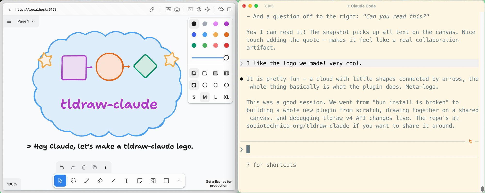

# tldraw-claude

A Claude Code plugin that gives Claude a shared [tldraw](https://tldraw.dev) canvas.

## What does it do?

You and Claude draw on the same canvas. You open a tldraw board in your browser, Claude gets tools to create shapes, connect them with arrows, and read what's on the canvas. You can both add and edit — it's a live, shared whiteboard.

Great for sketching architecture diagrams, flowcharts, database schemas, or just thinking visually together.



## How it works

```
Claude Code ←stdio→ MCP Server ←WebSocket→ tldraw widget (browser)
```

## Install

### Option A: Paste this into Claude Code

Copy and paste this prompt into Claude Code and it will set everything up for you:

```
Clone https://github.com/jessmartin/tldraw-claude to ~/.tldraw-claude, run ./setup,
then add it to .mcp.json as an MCP server (command: bun, args: ~/.tldraw-claude/src/mcp-server.ts).
Start the canvas with ~/.tldraw-claude/bin/tldraw-claude start.
```

### Option B: Claude Code plugin

Install directly from GitHub as a Claude Code plugin:

```bash
claude plugin marketplace add jessmartin/tldraw-claude --scope user
claude plugin install tldraw-claude@sociotechnica --scope user
```

This registers the plugin marketplace from the GitHub repo and installs the plugin. Use `--scope project` instead to install for a single project.

### Option C: Git clone + MCP config

```bash
git clone https://github.com/jessmartin/tldraw-claude.git ~/.tldraw-claude
cd ~/.tldraw-claude
./setup
```

Then add the MCP server to your project's `.mcp.json`:

```json
{
  "mcpServers": {
    "tldraw": {
      "command": "bun",
      "args": ["/Users/you/.tldraw-claude/src/mcp-server.ts"]
    }
  }
}
```

Replace the path with wherever you cloned the repo.

### Prerequisites

- [Bun](https://bun.sh) runtime
- [Claude Code](https://claude.ai/code) CLI

## Usage

### 1. Start the canvas

```bash
~/.tldraw-claude/bin/tldraw-claude start
```

This starts the tldraw widget (http://localhost:5173) and a WebSocket relay (ws://localhost:4000), then opens your browser.

### 2. Draw together

Ask Claude to draw something:

> "Draw a flowchart showing the request lifecycle in our app"

> "Sketch the architecture of our microservices"

> "Create a diagram of the database schema"

## Updating

**Plugin install:** If you installed with `claude plugin marketplace add`, updates pull automatically when Claude Code starts (with `autoUpdate: true`, the default).

**Git clone:** Pull and re-run setup:

```bash
cd ~/.tldraw-claude
git pull
./setup
```

## Tools

| Tool | Description |
|------|-------------|
| `create_shape` | Create geo shapes, text, or notes |
| `update_shape` | Modify position, size, color, text |
| `delete_shapes` | Remove shapes by ID |
| `connect_shapes` | Draw arrows between shapes |
| `get_snapshot` | List all shapes on canvas |
| `clear_canvas` | Wipe the canvas |

## CLI

```bash
tldraw-claude start    # Start widget + WS relay
tldraw-claude stop     # Stop background processes
tldraw-claude status   # Check if services are running
```

## License

MIT
